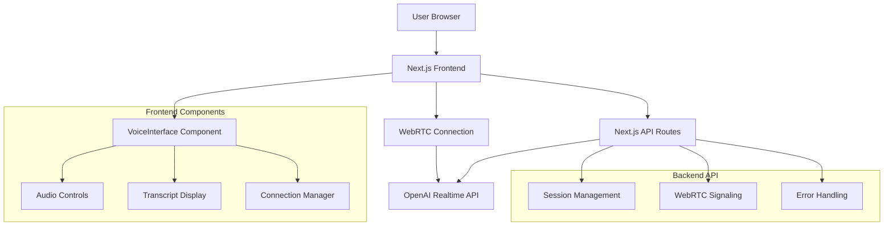

# Design Document

## Overview

The OpenAI Realtime Voice system implements a speech-to-speech voice interface using OpenAI's Realtime API with WebRTC transport. The architecture prioritizes low latency, natural conversation flow, and robust error handling. The system consists of a Next.js frontend with React components and Node.js API routes that interface with OpenAI's `gpt-4o-realtime-preview-2024-10-01` model.

The design follows a client-server architecture where the frontend manages WebRTC connections and audio streaming, while the backend handles OpenAI API authentication and session management. This separation ensures security (API keys never exposed to client) while maintaining optimal performance for real-time audio.

## Architecture

### High-Level Architecture



### Data Flow

1. **Session Initialization**: Frontend requests session creation from backend API
2. **WebRTC Setup**: Frontend establishes WebRTC peer connection with OpenAI
3. **Audio Streaming**: Bidirectional audio streams between browser and OpenAI
4. **Transcript Processing**: Real-time transcription displayed in UI
5. **Session Management**: Backend handles session lifecycle and cleanup

### Technology Stack

- **Frontend**: React 18, TypeScript, Tailwind CSS
- **Backend**: Next.js API Routes, Node.js
- **Audio**: WebRTC, Web Audio API, MediaRecorder API
- **AI Service**: OpenAI Realtime API (gpt-4o-realtime-preview-2024-10-01)
- **Transport**: WebRTC for low-latency audio streaming

## Components and Interfaces

### Frontend Components

#### VoiceInterface Component
**Purpose**: Main orchestrator component managing the entire voice interaction flow
**Responsibilities**:
- Coordinate between audio controls, transcript display, and connection management
- Manage application state (connected, listening, muted)
- Handle user interactions and provide feedback

```typescript
interface VoiceInterfaceProps {
  initialConfig?: VoiceConfig;
  onError?: (error: Error) => void;
  onTranscriptUpdate?: (transcript: TranscriptEntry[]) => void;
}

interface VoiceInterfaceState {
  isConnected: boolean;
  isListening: boolean;
  isMuted: boolean;
  transcript: TranscriptEntry[];
  session: RealtimeSession | null;
  error: string | null;
}
```

#### AudioManager Component
**Purpose**: Handle all audio-related operations including WebRTC setup and stream management
**Responsibilities**:
- Establish and manage WebRTC peer connections
- Handle microphone access and audio stream processing
- Manage audio output and playback controls
- Implement audio quality optimization (echo cancellation, noise suppression)

```typescript
interface AudioManagerProps {
  session: RealtimeSession;
  onAudioLevel?: (level: number) => void;
  onConnectionStateChange?: (state: RTCPeerConnectionState) => void;
}

interface AudioStreamConfig {
  echoCancellation: boolean;
  noiseSuppression: boolean;
  autoGainControl: boolean;
  sampleRate?: number;
}
```

#### TranscriptDisplay Component
**Purpose**: Real-time display of conversation transcript with auto-scrolling
**Responsibilities**:
- Render conversation history with speaker identification
- Auto-scroll to latest messages
- Handle transcript formatting and timestamps
- Provide search and export functionality

```typescript
interface TranscriptEntry {
  id: string;
  speaker: 'user' | 'emma';
  text: string;
  timestamp: Date;
  confidence?: number;
}

interface TranscriptDisplayProps {
  entries: TranscriptEntry[];
  maxEntries?: number;
  autoScroll?: boolean;
}
```

#### ConnectionControls Component
**Purpose**: UI controls for managing voice session (connect, disconnect, mute, etc.)
**Responsibilities**:
- Provide intuitive controls for session management
- Display connection status with visual indicators
- Handle user input validation and feedback
- Implement accessibility features (keyboard navigation, screen reader support)

```typescript
interface ConnectionControlsProps {
  isConnected: boolean;
  isListening: boolean;
  isMuted: boolean;
  onConnect: () => Promise<void>;
  onDisconnect: () => Promise<void>;
  onToggleListening: () => void;
  onToggleMute: () => void;
}
```

### Backend API Interfaces

#### Session Management API
**Purpose**: Handle OpenAI Realtime API session lifecycle
**Endpoints**:
- `POST /api/emma/realtime/session` - Create new session
- `POST /api/emma/realtime/connect` - Establish WebRTC connection
- `POST /api/emma/realtime/disconnect` - Clean up session

```typescript
interface CreateSessionRequest {
  voice?: 'alloy' | 'echo' | 'fable' | 'onyx' | 'nova' | 'shimmer';
  instructions?: string;
  temperature?: number;
}

interface CreateSessionResponse {
  sessionId: string;
  expiresAt: number;
  clientSecret: string;
}

interface ConnectRequest {
  sessionId: string;
  sdp: string;
  type: 'offer' | 'answer';
}

interface ConnectResponse {
  sdp: string;
  type: 'offer' | 'answer';
}
```

### Core Services

#### RealtimeSessionManager
**Purpose**: Manage OpenAI Realtime API sessions and handle authentication
**Responsibilities**:
- Create and configure OpenAI sessions with proper parameters
- Handle API authentication and rate limiting
- Manage session expiration and renewal
- Implement retry logic for failed requests

```typescript
class RealtimeSessionManager {
  async createSession(config: SessionConfig): Promise<RealtimeSession>;
  async establishConnection(sessionId: string, offer: RTCSessionDescription): Promise<RTCSessionDescription>;
  async terminateSession(sessionId: string): Promise<void>;
  private handleApiError(error: any): never;
}
```

#### WebRTCManager
**Purpose**: Handle WebRTC peer connection setup and management
**Responsibilities**:
- Configure WebRTC with optimal settings for voice
- Handle ICE candidate exchange and connection establishment
- Manage audio tracks and stream processing
- Implement connection recovery and fallback mechanisms

```typescript
class WebRTCManager {
  private peerConnection: RTCPeerConnection;
  private audioStream: MediaStream | null;
  
  async initialize(iceServers: RTCIceServer[]): Promise<void>;
  async createOffer(): Promise<RTCSessionDescription>;
  async handleAnswer(answer: RTCSessionDescription): Promise<void>;
  async addAudioTrack(stream: MediaStream): Promise<void>;
  cleanup(): void;
}
```

## Data Models

### Session Models

```typescript
interface RealtimeSession {
  sessionId: string;
  expiresAt: number;
  clientSecret?: string;
  status: 'creating' | 'active' | 'expired' | 'terminated';
  createdAt: Date;
}

interface VoiceConfig {
  voice: 'alloy' | 'echo' | 'fable' | 'onyx' | 'nova' | 'shimmer';
  instructions: string;
  temperature: number;
  model: string;
  modalities: string[];
  turnDetection: TurnDetectionConfig;
}

interface TurnDetectionConfig {
  type: 'server_vad' | 'none';
  threshold?: number;
  silenceDurationMs?: number;
  prefixPaddingMs?: number;
}
```

### Audio Models

```typescript
interface AudioConfig {
  sampleRate: number;
  channels: number;
  echoCancellation: boolean;
  noiseSuppression: boolean;
  autoGainControl: boolean;
}

interface AudioMetrics {
  inputLevel: number;
  outputLevel: number;
  latency: number;
  packetLoss: number;
  connectionQuality: 'excellent' | 'good' | 'fair' | 'poor';
}
```

### Transcript Models

```typescript
interface TranscriptEntry {
  id: string;
  sessionId: string;
  speaker: 'user' | 'emma';
  text: string;
  timestamp: Date;
  confidence: number;
  audioUrl?: string;
}

interface ConversationSession {
  id: string;
  startTime: Date;
  endTime?: Date;
  entries: TranscriptEntry[];
  metadata: SessionMetadata;
}
```

## Error Handling

### Error Categories

1. **Connection Errors**: Network issues, WebRTC failures, API timeouts
2. **Authentication Errors**: Invalid API keys, expired sessions, rate limits
3. **Audio Errors**: Microphone access denied, audio device issues, codec problems
4. **Browser Compatibility**: Unsupported features, permission issues

### Error Handling Strategy

```typescript
interface ErrorHandler {
  handleConnectionError(error: ConnectionError): Promise<void>;
  handleAuthenticationError(error: AuthError): Promise<void>;
  handleAudioError(error: AudioError): Promise<void>;
  handleBrowserCompatibilityError(error: CompatibilityError): Promise<void>;
}

class VoiceErrorHandler implements ErrorHandler {
  async handleConnectionError(error: ConnectionError): Promise<void> {
    // Implement exponential backoff retry
    // Show user-friendly error messages
    // Attempt connection recovery
  }
  
  async handleAuthenticationError(error: AuthError): Promise<void> {
    // Clear invalid sessions
    // Redirect to configuration if needed
    // Log security events
  }
  
  async handleAudioError(error: AudioError): Promise<void> {
    // Guide user through permission setup
    // Suggest alternative audio devices
    // Provide troubleshooting steps
  }
}
```

### Recovery Mechanisms

1. **Automatic Retry**: Exponential backoff for transient failures
2. **Graceful Degradation**: Fallback to text-only mode if audio fails
3. **Session Recovery**: Restore conversation state after reconnection
4. **User Guidance**: Clear instructions for resolving common issues

## Testing Strategy

### Unit Testing
- **Component Testing**: React components with Jest and React Testing Library
- **Service Testing**: API routes and business logic with comprehensive mocks
- **Utility Testing**: Audio processing functions and error handlers

### Integration Testing
- **API Integration**: End-to-end testing of OpenAI Realtime API integration
- **WebRTC Testing**: Connection establishment and audio streaming validation
- **Browser Testing**: Cross-browser compatibility verification

### Performance Testing
- **Latency Measurement**: Audio round-trip time monitoring
- **Memory Usage**: Long-running session memory leak detection
- **Concurrent Users**: Multiple simultaneous connection handling

### User Acceptance Testing
- **Voice Quality**: Subjective audio quality assessment
- **Conversation Flow**: Natural interaction pattern validation
- **Error Recovery**: User experience during failure scenarios

```typescript
// Example test structure
describe('VoiceInterface', () => {
  describe('Connection Management', () => {
    it('should establish connection successfully', async () => {
      // Test connection flow
    });
    
    it('should handle connection failures gracefully', async () => {
      // Test error scenarios
    });
  });
  
  describe('Audio Processing', () => {
    it('should capture and stream audio correctly', async () => {
      // Test audio functionality
    });
  });
  
  describe('Transcript Display', () => {
    it('should update transcript in real-time', async () => {
      // Test transcript functionality
    });
  });
});
```

### Testing Tools and Frameworks
- **Jest**: Unit and integration testing framework
- **React Testing Library**: Component testing utilities
- **Playwright**: End-to-end browser testing
- **WebRTC Testing**: Custom utilities for audio stream validation
- **Performance Monitoring**: Real User Monitoring (RUM) integration